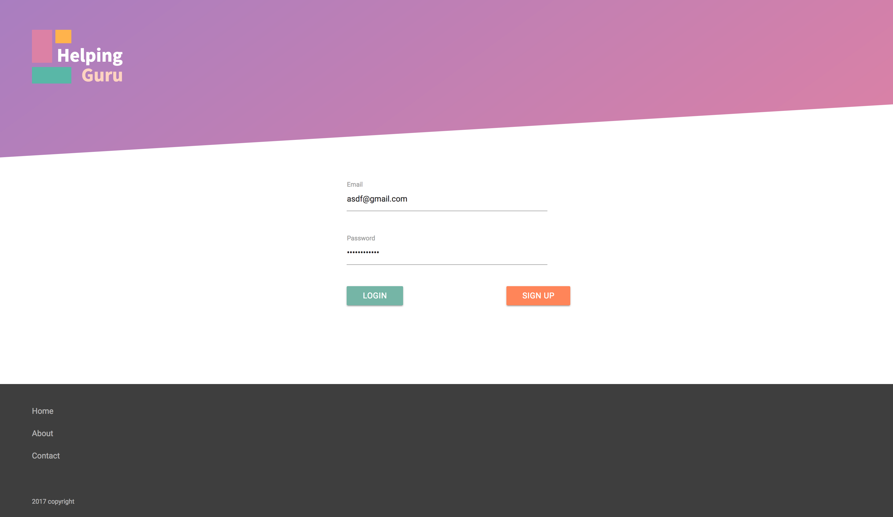
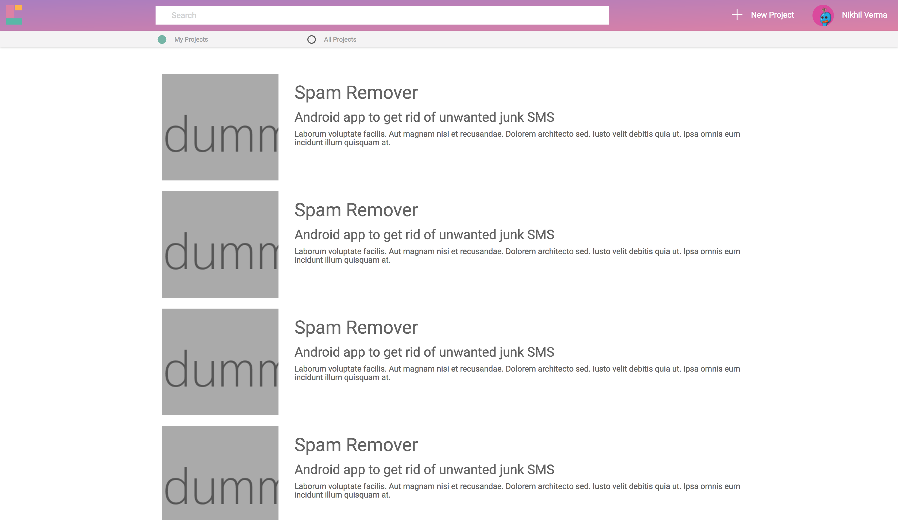

# Short:
Hackathon > 24 hours > Simple Idea > Project Management for beginners > Completion Status : backend = 90% , frontend = 40%

# Long:
For a hackathon event taking place at Binghampton University, I ideated working on a webapp which pairs novice programmers to expert ones.We managed to complete a major portion of the backend but we could'nt finish on time.  Nevertheless, we learned a lot.

## Idea
Helping Guru is a social platform that helps beginner developers in their projects by attaching
mentors to it. The idea revolves around focusing on providing a more contextual knowledge to the user and not
a generic answer as found in more Q/A websites. Mentors are peer users in the site that would volunteer to help,
those in need.

##### Login Page

##### Dashboard

### Instructions
1. npm install
2. *Make sure [OrientDB server is installed and running](http://orientdb.com/docs/2.1/Tutorial-Run-the-server.html)
3. npm run build:client
4. npm run compile:server
5. npm start
6. npm run watch:client (seperate window)

*The project is setup with credentials set to username: root and password: root. To change these credentials, go to server/index.ts.

#### Currently in development
This project started as a hackathon idea and still in development phase. Most of the backend work is done. Whats left are some
frontend screens and integration. I will only work on this project if someone thinks this is a **good idea**.